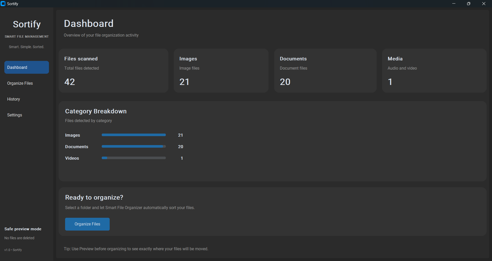
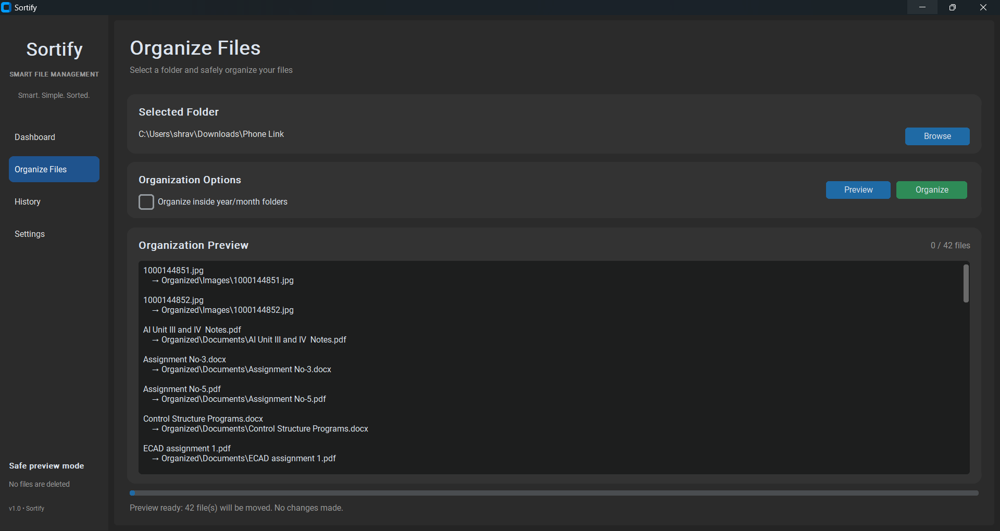
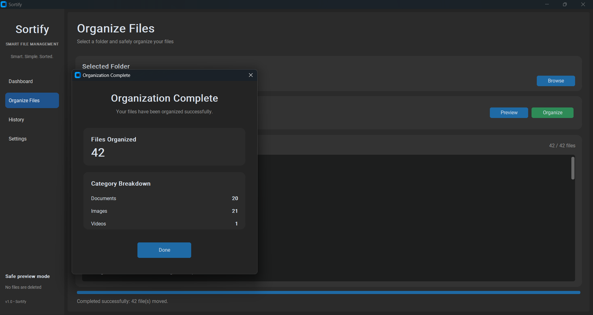
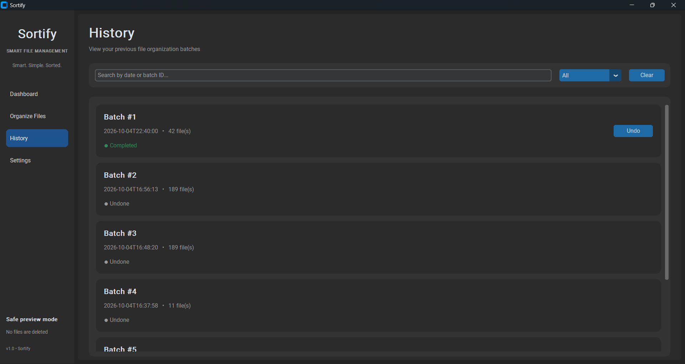
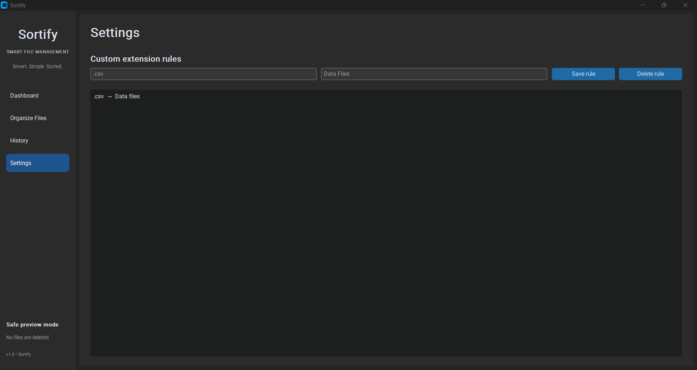

# 📁 Sortify

### Smart. Simple. Sorted.

Sortify is a professional desktop file organization application built with Python and CustomTkinter.

It automatically organizes files into meaningful categories based on their file types, while providing preview mode, custom organization rules, history tracking, undo support, and activity analytics.

---

## ✨ Features

### 📂 Smart File Organization

Automatically detects file types and organizes them into categories such as:

* Images
* Documents
* Videos
* Audio
* Archives
* Code
* Others

### 👀 Preview Mode

See exactly where files will be moved before applying any changes.

### 📅 Date-Based Organization

Files can optionally be organized using:

```text
Organized/
├── Images/
│   └── 2026/
│       └── October/
├── Documents/
│   └── 2026/
│       └── October/
└── Videos/
    └── 2026/
        └── October/
```

### ⚙️ Custom Extension Rules

Create your own rules for file extensions.

Example:

```text
.csv → Data Files
.log → Logs
.ipynb → Notebooks
```

Custom rules can also be deleted or updated.

### ↩️ Undo Support

Accidentally organized files?

Sortify keeps track of organization batches so files can be restored using the Undo feature.

### 📊 Dashboard Analytics

The dashboard provides an overview of:

* Total files scanned
* Images
* Documents
* Media
* Category breakdown

### 🕘 Organization History

Every organization batch is recorded in SQLite.

History includes:

* Batch number
* Date and time
* Number of files
* Completion status
* Undo option

### 🔎 Search & Filter

History can be searched using:

* Batch ID
* Date
* File count

You can also filter batches by:

* All
* Completed
* Undone

### 📋 Organization Summary

After organizing files, Sortify displays a summary showing the result of the operation.

### 🛡️ Safe File Handling

Sortify includes several safety mechanisms:

* Preview before organization
* Duplicate filename handling
* Organization history
* Undo functionality
* Validation of selected folders
* Files are moved rather than deleted

---

## 🛠️ Tech Stack

| Technology    | Purpose                    |
| ------------- | -------------------------- |
| Python        | Core application logic     |
| CustomTkinter | Desktop GUI                |
| SQLite        | History and custom rules   |
| pathlib       | File and path handling     |
| shutil        | File operations            |
| dataclasses   | Structured file operations |

---

## 📂 Project Structure

```text
Sortify/
│
├── main.py
├── database.py
├── file_detector.py
├── organizer.py
├── undo_manager.py
├── duplicate_checker.py
├── requirements.txt
├── README.md
├── tests/
│   ├── __init__.py
│   └── test_organizer.py
│
└── gui/
    ├── __init__.py
    ├── app.py
    ├── dashboard.py
    ├── history.py
    ├── settings.py
    └── theme.py
```

> `organizer.db` and `.venv` are intentionally excluded from the repository using `.gitignore`.

---

## 🚀 Getting Started

### 1. Clone the repository

```bash
git clone https://github.com/shravani-repo/Sortify.git
```

Move into the project directory:

```bash
cd Sortify
```

### 2. Create and activate a virtual environment

```bash
python -m venv .venv
```

On Windows:

```bash
.venv\Scripts\activate
```

### 3. Install dependencies

```bash
pip install -r requirements.txt
```

### 4. Run Sortify

```bash
python main.py
```

The Sortify desktop application will launch.

---

## 🔄 How Sortify Works

The basic workflow is:

```text
Select Folder
      ↓
Detect Files
      ↓
Determine Categories
      ↓
Preview Changes
      ↓
Organize Files
      ↓
Save History
      ↓
View Summary
```

Users can then view the operation in History and undo a completed batch if required.

---

## 🖥️ Application Sections

### Dashboard

Provides a quick overview of the selected folder and displays file statistics and category distribution.

### Organize Files

Allows users to:

* Select a folder
* Enable date-based organization
* Preview planned operations
* Organize files
* View organization progress

### History

Displays previous organization batches with search, filtering, and undo functionality.

### Settings

Allows users to create and manage custom extension rules.

---

## 🧠 Example

Suppose a folder contains:

```text
photo.jpg
resume.pdf
song.mp3
project.py
movie.mp4
data.csv
```

Sortify can organize them into:

```text
Organized/
│
├── Images/
│   └── photo.jpg
│
├── Documents/
│   └── resume.pdf
│
├── Audio/
│   └── song.mp3
│
├── Videos/
│   └── movie.mp4
│
├── Code/
│   └── project.py
│
└── Data Files/
    └── data.csv
```

The **Data Files** category can be created using a custom `.csv` rule.

---

## 🎯 Project Goals

Sortify was developed to demonstrate practical desktop application development using Python.

The project focuses on:

* GUI development
* File system automation
* Object-oriented programming
* Database integration
* Error handling
* User experience
* Modular software architecture

---

## 🔮 Future Improvements

Possible future versions may include:

* 🎨 Custom application icon
* 🌙 Advanced dark/light themes
* 📦 Windows `.exe` installer
* 📈 More detailed analytics
* 🗂️ Additional file categories
* 🔍 Advanced file search
* ⚡ Faster bulk organization
* ☁️ Cloud backup integration
* 🔐 Additional safety confirmations

---

## 📸 Screenshots

### Dashboard



### Organize Files



### Preview



### History



### Settings



---

## 📌 Version

**Sortify v1.0**

**Smart. Simple. Sorted.**

---

## 👩‍💻 Author

**Shravani Raut**

BTech — Artificial Intelligence & Data Science

Interested in:

* Python
* Artificial Intelligence
* Data Science
* Software Development
* Automation

---

## ⭐ Support

If you find Sortify useful or interesting, consider giving the repository a ⭐ on GitHub.

---

## 📄 License

This project is intended for educational and portfolio purposes.
